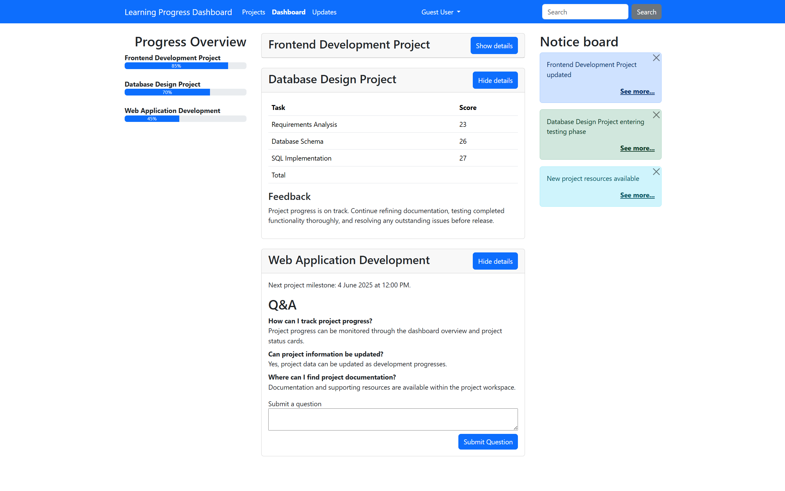

# Learning Progress Dashboard

## Overview

Learning Progress Dashboard is a responsive web application built with HTML, CSS, JavaScript and Bootstrap. The application allows users to track project progress, view feedback, browse project-related questions and answers, and submit new questions through an interactive interface.

The project demonstrates client-server communication using JavaScript Fetch API requests and a Node.js/Express backend.

## Features

* Interactive project dashboard
* Dynamic feedback loading
* Question and answer section
* Question submission form
* Progress overview with visual progress bars
* Notice board for project updates
* Responsive Bootstrap-based interface
* REST-style API endpoints

## Technologies Used

* HTML5
* CSS3
* JavaScript (ES6)
* Bootstrap 5
* Node.js
* Express.js
* Fetch API

## Installation

1. Clone the repository:

```bash
git clone https://github.com/Jubster/learning_progress_dashboard.git
```

2. Install dependencies:

```bash
npm install
```

3. Start the application:

```bash
node server.js
```

4. Open:

```text
http://localhost:8080
```

in your browser.

## Live Demo

https://learning-progress-dashboard.onrender.com

## API Endpoints

### GET /api/feedback

Returns project feedback text.

### GET /api/q-and-a

Returns a list of questions and answers in JSON format.

## Project Structure

```text
app/
├── index.html
├── index.css
└── index.js

server.js
package.json
```

## Screenshot


## Author

Jakub Borkowski
